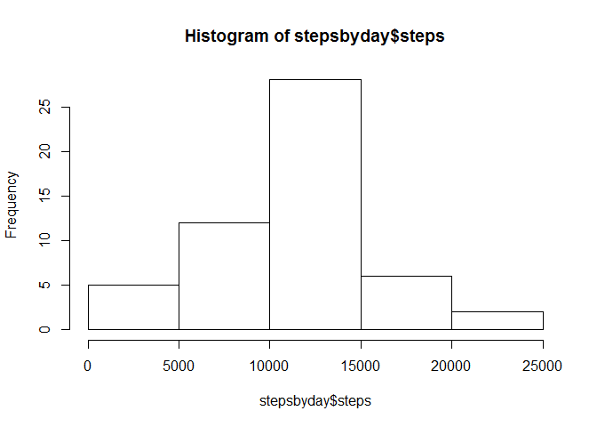
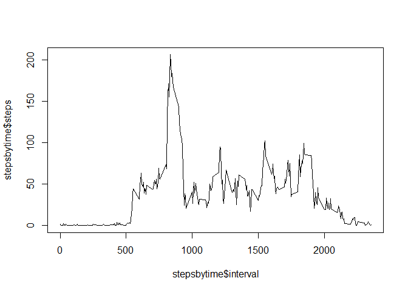
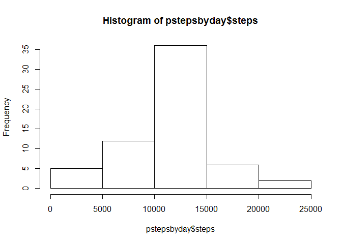
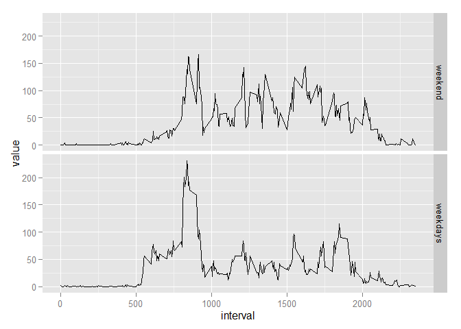

# Reproducible Research: Peer Assessment 1
Martijn Vellinger  
2015-07-19  


## Loading and preprocessing the data

We will begin our analysis by loading our data set into memory.

```r
    unzip("activity.zip")
    rawdata <- read.csv("activity.csv")
```

Our raw data appears to be tidy, apart from a relatively large number of 
NA values there is not a whole lot of preproccessing to be done.


```r
    head(rawdata)
```

```
##   steps       date interval
## 1    NA 2012-10-01        0
## 2    NA 2012-10-01        5
## 3    NA 2012-10-01       10
## 4    NA 2012-10-01       15
## 5    NA 2012-10-01       20
## 6    NA 2012-10-01       25
```


## What is the mean total number of steps taken per day?

Let's start by making a dataframe from our raw data that adds up the steps
We can easily do this using the *aggregate* function:


```r
    stepsbyday <- aggregate(steps~date, data=rawdata, FUN=sum, na.action = na.omit)
    head(stepsbyday, n=3)
```

```
##         date steps
## 1 2012-10-02   126
## 2 2012-10-03 11352
## 3 2012-10-04 12116
```
    
Now that we have calculated the total steps taken each day, we can simply ask R 
to give us a histogram:


```r
    hist(stepsbyday$steps)
```

 

We can also find the mean and median:


```r
    mean(stepsbyday$steps)
```

```
## [1] 10766.19
```

```r
    median(stepsbyday$steps)
```

```
## [1] 10765
```


## What is the average daily activity pattern?

To plot the average steps taken in each 5-minute interval, we can make another
aggregate, this time grouping the mean of steps taken per interval, by interval:


```r
    stepsbytime <- aggregate(steps~interval, data=rawdata, FUN=mean, na.action=na.omit)
    head(stepsbytime, n=3)
```

```
##   interval     steps
## 1        0 1.7169811
## 2        5 0.3396226
## 3       10 0.1320755
```
  


Next we can plot the values in our dataframe using the *plot* function,
specifying *type="l"* to get a line chart:


```r
     plot(stepsbytime$interval, stepsbytime$steps, type="l")
```

 

Likewise we can easily determine which interval contains the most steps by
asking R which row contains the maximum value, and retrieving the corresponding
interval:


```r
    stepsbytime$interval[which.max(stepsbytime$steps)]
```

```
## [1] 835
```


## Imputing missing values

Count the number of missing values in our raw data:


```r
    length(which(is.na(rawdata$steps)))
```

```
## [1] 2304
```

We previously created a dataframe that contains the mean steps taken for each
interval, we can use this dataframe to replace our NA values with the mean value
for that particular interval.

We will use a simple loop to iterate over each row, check if it contains an NA
value, and if so, replace it with the mean value from our *stepsbytime* table


```r
    pdata <- rawdata #copy our raw data to a new frame
    
    for (i in 1:NROW(pdata)) { #loop over each row
      
        if(is.na(pdata[i,1]==TRUE)) { #test if steps value is NA
            
            #look up the mean value corresponding to the interval value and
            #replace the NA value with it
            pdata[i,1] <- stepsbytime$steps[which(stepsbytime$interval==pdata[i,3])]
        } 
    }
```

We can now aggregate the new *pdata* dataframe as before, and make a histogram and
calculate the mean and median values as we did before:


```r
    pstepsbyday <- aggregate(steps~date, data=pdata, FUN=sum, na.action = na.omit)
    hist(pstepsbyday$steps)
```

 

```r
    mean(pstepsbyday$steps)
```

```
## [1] 10766.19
```

```r
    median(pstepsbyday$steps)
```

```
## [1] 10766.19
```

Superficially the results appear almost identical, but the median value has now
become the same as the mean.

## Are there differences in activity patterns between weekdays and weekends?

We will add a column to our *pdata* dataframe to indicate if the day in question
is a weekday or not.

To do so we will first create a vector containing the values "weekday" or
"weekend", depending on the outcome of a logical test we perform on the date
field to determine if that date was a saturday or sunday.


```r
    daytype <- vector(mode= "character") #initialize vector
    for(j in 1:NROW(pdata)){ #loop through all rows
        
        if(weekdays(as.Date(pdata[j,2]))== "Sunday") {
            daytype <- c(daytype, "weekend")
        } else {
            if(weekdays(as.Date(pdata[j,2]))== "Saturday") {
                daytype <- c(daytype, "weekend")
            } else {
                daytype <- c(daytype, "weekday")  
            }
        }
    }
    pdata$daytype <- daytype #add the colum
    head(pdata, n=3)
```

```
##       steps       date interval daytype
## 1 1.7169811 2012-10-01        0 weekday
## 2 0.3396226 2012-10-01        5 weekday
## 3 0.1320755 2012-10-01       10 weekday
```

Next we will subset and aggregate the weekends and weekdays into separate 
dataframes, remerge them and melt them into long form.

(this makes the plotting in ggplot simpler)


```r
    library(reshape2) #we will use reshape to conver to long form
    library(ggplot2) #we will use ggplot2 to make our graph
```

```
## Warning: package 'ggplot2' was built under R version 3.2.1
```

```r
    SBTweekday <- aggregate(steps~interval, data=subset(pdata, daytype=="weekday"), FUN=mean, na.action=na.omit)
    SBTweekend <- aggregate(steps~interval, data=subset(pdata, daytype=="weekend"), FUN=mean, na.action=na.omit)
    #combine the two
    
    final <- data.frame(interval=SBTweekday[ ,1], weekend=SBTweekend[ ,2], weekdays=SBTweekday[ ,2])
    finalmelt <- melt(final, id.vars ="interval")
    
    ggplot(data=finalmelt, aes(x=interval,y=value), )+geom_line()+ facet_grid(variable ~ .)
```

 


